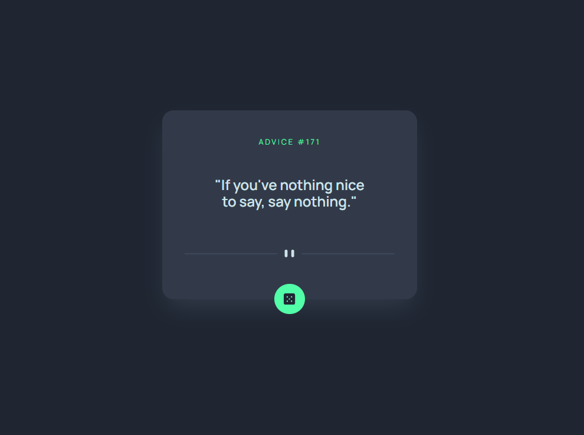

# Frontend Mentor - Advice generator app solution

This is a solution to the [Advice generator app challenge on Frontend Mentor](https://www.frontendmentor.io/challenges/advice-generator-app-QdUG-13db).

## Table of contents

- [Overview](#overview)
  - [The challenge](#the-challenge)
  - [Screenshot](#screenshot)
  - [Links](#links)
- [My process](#my-process)
  - [Built with](#built-with)
  - [What I learned](#what-i-learned)
  - [Useful resources](#useful-resources)
- [Author](#author)
- [Acknowledgments](#acknowledgments)


## Overview

### The challenge

Users should be able to:

- View the optimal layout for the app depending on their device's screen size
- See hover states for all interactive elements on the page
- Generate a new piece of advice by clicking the dice icon

### Screenshot




### Links

- Solution URL: [solution](https://github.com/trevornei/advice-generator-app)

## My process
  1. Create the static versioning for react elements.
  2. Determine where the state needs to live? ---> QuoteCont.jsx
  3. Create a useState hook to store the value of the data coming in from [AdviceSlipAPI](https://api.adviceslip.com/)
  ```
   const [advice, setAdvice] = useState(null)
  ```
  4. Once the URL variable was created (storing the url for random advice) I made a function that makes a GET HTTP request, turns the data into JSON format, calls the setAdvice function and passes the JSON data as an argument to setAdvice. QuoteCont: line 34-41
  5. Call the useEffect() hook and call the getAdvice() fn inside the former. This GETs the data when the component mounts.

  6. To pass down the data to the child elements, I needed to validate that [advice] was populated with data.
  ```
    {advice && <QuoteNum quoteNum={advice.slip.id} />}
    {advice && <QuoteBody adviceBody={advice.slip} />}
  ```
  7. Passed down the relevant data down to QuoteNum and QuoteBody via propDrilling.

  8. Then I made a way for users to obtain new advice by clicking on the Dice Button.
  9. Passed down getAdvice as props to DiceCont.
  10. For DiceCont.jsx I made sure to wrap all content inside the return statement, in a fragment. This allowed me to wrap the button around the div(making the neon green circle) and the dice svg. This ensured ease of use when interacting with the button. Both the button and svg triggered the getAdvice() fn.

  11. I made the components responsive.
    

### Built with

- [React](https://reactjs.org/) - JS library
- Tailwind
- Mobile-first workflow

### What I learned

For this project, I added new fonts, colors, and letterSpacing keyvalue pairs to the tailwind.config.js file.

```js
export default {
  content: [
    "./index.html",
    "./src/**/*.{js,ts,jsx,tsx}",
  ],
  theme: {
    fontFamily: {
      'manrope': ['Manrope'],
      'hedvig': ['Hedvig Letters Serif'],
    },
    colors: {
      'lightCyan': '#cee3e9',
      'neonGreen': '#52ffa8',
      'grayishBlue': '#4e5d73',
      'darkishBlue': '#323a49',
      'darkBlue': '#1f2632',
    },
    letterSpacing: {
      extraWide: '.22em'
    }
```

### Useful resources

- [Tailwind - Visibility](https://tailwindcss.com/docs/visibility) - I learned that if I want to display content as hidden at a certain breakpoint that it's best practice to use ex: className"md:invisible".

## Author

- Website - [Trevor Nei Linkedin](https://www.linkedin.com/in/trevornei-webdev/)
- Twitter - [Github](https://github.com/trevornei)
